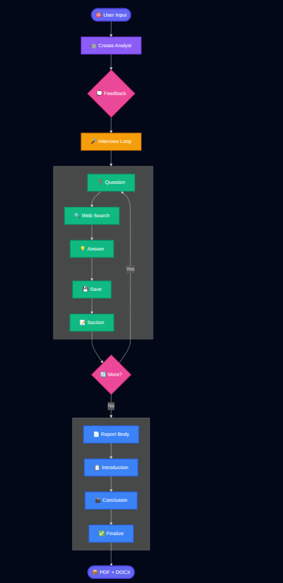
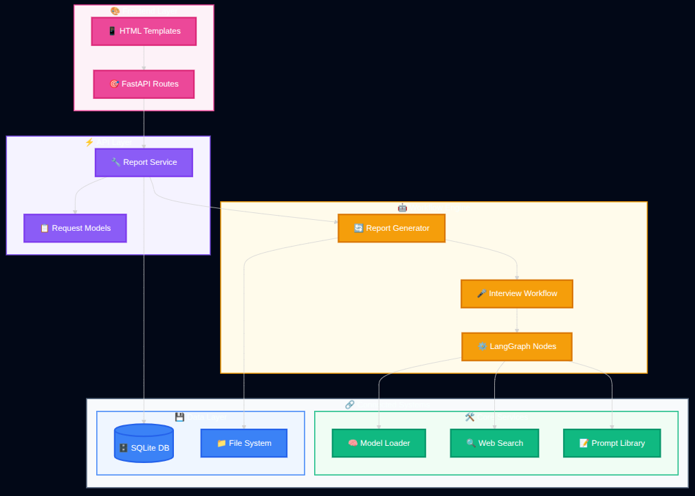

# 📊 Automated Report Generation

> An intelligent research assistant that automatically generates comprehensive, well-structured reports using AI-powered analyst agents, web research, and human feedback.

[](https://www.python.org/downloads/)
[](https://fastapi.tiangolo.com/)
[](https://langchain-ai.github.io/langgraph/)
[](https://azure.microsoft.com/)
[](https://www.jenkins.io/)
[](LICENSE)

---

## 🌟 Overview

**Automated Report Generation** is a sophisticated research automation system that leverages LangGraph workflow orchestration to create detailed, professional reports on any topic. The system creates intelligent analyst agents that conduct web research, generate interview-style Q&A sessions, and compile comprehensive reports with structured sections.

**Key Highlights:**
- 🤖 AI-powered analyst agents with web research capabilities
- 📝 Multi-format output (PDF & DOCX)
- ☁️ Production-ready Azure deployment with CI/CD
- 🔐 Secure authentication and encrypted storage
- 🚀 Automated deployment pipeline with Jenkins

---

## ✨ Features

- 🤖 **AI-Powered Analyst Agents**: Creates specialized analyst personas based on your research topic
- 🔍 **Intelligent Web Research**: Real-time information gathering using Tavily API
- 👥 **Human-in-the-Loop**: Integrates user feedback to refine research direction
- 📝 **Structured Reports**: Generates introduction, body sections, and conclusion
- 📄 **Multi-Format Export**: PDF and DOCX output formats
- ☁️ **Cloud-Native**: Fully containerized deployment on Azure
- 🔄 **CI/CD Pipeline**: Automated build and deployment with Jenkins
- 🔐 **Secure Authentication**: Encrypted password storage with SQLite

---

## 🏗️ Architecture

### System Workflow

The application follows a sophisticated multi-stage workflow orchestrated by LangGraph:



### Component Architecture



### Cloud Deployment Architecture

```
GitHub Repository
      ↓ (webhook trigger)
Jenkins CI/CD (Azure Container Instance)
      ↓ (build & push)
Azure Container Registry
      ↓ (deploy)
Azure Container Apps (Production)
      ↓ (persist reports)
Azure Blob Storage
```

---

## 📂 Project Structure

```
automated-report-generation/
│
├── research_and_analyst/           # Main application package
│   ├── api/                        # FastAPI application
│   │   ├── main.py                 # FastAPI app entry point
│   │   ├── models/                 # Request/response models
│   │   │   └── request_models.py
│   │   ├── routes/                 # API endpoints
│   │   │   └── report_routes.py
│   │   ├── services/               # Business logic
│   │   │   └── report_service.py
│   │   └── templates/              # HTML templates
│   │       ├── dashboard.html      # Main dashboard
│   │       ├── login.html          # Login page
│   │       ├── signup.html         # User registration
│   │       └── report_progress.html # Progress tracking
│   │
│   ├── workflows/                  # LangGraph workflow definitions
│   │   ├── interview_workflow.py   # Interview Q&A generation
│   │   └── report_generator_workflow.py  # Main report workflow
│   │
│   ├── config/                     # Configuration files
│   │   └── configuration.yaml      # App settings
│   │
│   ├── database/                   # Database management
│   │   └── db_config.py            # SQLite setup
│   │
│   ├── schemas/                    # Data models
│   │   └── models.py               # Pydantic schemas
│   │
│   ├── utils/                      # Utility functions
│   │   ├── config_loader.py        # Config management
│   │   └── model_loader.py         # LLM initialization
│   │
│   ├── prompt_lib/                 # Prompt templates
│   │   └── prompt_locator.py
│   │
│   ├── logger/                     # Logging configuration
│   │   └── custom_logger.py
│   │
│   ├── exception/                  # Custom exceptions
│   │   └── custom_exception.py
│   │
│   └── notebook/                   # Development notebooks
│       └── test.ipynb
│
├── static/                         # Frontend assets
│   ├── css/
│   │   └── styles.css
│   └── js/
│       └── app.js
│
├── templates/                      # Additional templates
│
├── generated_report/               # Output directory
│   └── [Topic_Timestamp]/          # Individual report folders
│       ├── [Report].pdf
│       └── [Report].docx
│
├── logs/                           # Application logs
│
├── users.db                        # SQLite database
├── requirements.txt                # Python dependencies
├── pyproject.toml                  # Project metadata
├── main.py                         # CLI entry point
└── README.md                       # Project documentation
```

---


## 🚀 Quick Start

### Local Development

```bash
# Clone repository
git clone https://github.com/Krishna-Thakkar/automated-research-report-generation.git
cd automated-research-report-generation

# Create virtual environment
python -m venv venv
source venv/bin/activate  # On Windows: venv\Scripts\activate

# Install dependencies
pip install -r requirements.txt

# Configure environment variables
cat > .env << EOF
GROQ_API_KEY=your_groq_api_key
GOOGLE_API_KEY=your_google_api_key
TAVILY_API_KEY=your_tavily_api_key
LLM_PROVIDER=google
EOF

# Run application
uvicorn research_and_analyst.api.main:app --host 0.0.0.0 --port 8000
```

Access at: `http://localhost:8000`

---

## ☁️ Cloud Deployment (Azure)

### Prerequisites
- Azure account with active subscription
- Azure CLI installed (`az login` completed)
- GitHub repository access
- API keys (Groq/Google, Tavily)

### Deployment Overview

This deployment sets up:
- ✅ Jenkins CI/CD server on Azure Container Instances
- ✅ Azure Container Registry for Docker images
- ✅ Azure Container Apps for production hosting
- ✅ Azure Blob Storage for report persistence
- ✅ Automated GitHub webhook integration

### 🎯 Deployment Steps

#### 1. Deploy Jenkins Infrastructure

```bash
bash ./azure-deploy-jenkins.sh
```

**Output:** You'll receive a Jenkins URL and instructions to retrieve the admin password.

```bash
# Get Jenkins password
az container exec \
  --resource-group research-report-jenkins-rg \
  --name jenkins-research-report \
  --exec-command 'cat /var/jenkins_home/secrets/initialAdminPassword'
```

Save the password for Jenkins login (username: `admin`).

#### 2. Configure Jenkins

1. Access Jenkins at the provided URL
2. Login with admin credentials
3. Install suggested plugins
4. Navigate to **Manage Jenkins** → **Security** → Enable **"Enable proxy compatibility"** under CSRF Protection

#### 3. Provision Azure Infrastructure

```bash
bash ./setup-app-infrastructure.sh
```

**Output:** You'll receive credentials for ACR, Storage Account, and other Azure resources. Save these values.

#### 4. Setup Azure Service Principal

```bash
az ad sp create-for-rbac \
  --name "jenkins-research-report-sp" \
  --role Contributor \
  --scopes /subscriptions/$(az account show --query id -o tsv)
```

Save the output JSON (appId, password, tenant).

#### 5. Add Credentials to Jenkins

Navigate to **Manage Jenkins** → **Credentials** → **(global)** → **Add Credentials**

Add the following as **Secret text** credentials:

**From Step 3 output:**
- `acr-username` → Your ACR username
- `acr-password` → Your ACR password
- `storage-account-name` → Your storage account name
- `storage-account-key` → Your storage account key

**From Step 4 output:**
- `azure-client-id` → appId from JSON
- `azure-client-secret` → password from JSON
- `azure-tenant-id` → tenant from JSON
- `azure-subscription-id` → Run: `az account show --query id -o tsv`

**API Keys:**
- `GROQ_API_KEY` → Your Groq API key
- `GOOGLE_API_KEY` → Your Google API key
- `TAVILY_API_KEY` → Your Tavily API key
- `LLM_PROVIDER` → `google` or `groq`

#### 6. Build Initial Docker Image

```bash
bash ./build-and-push-docker-image.sh
```

This builds and pushes your Docker image to Azure Container Registry.

#### 7. Create Jenkins Pipeline

1. **Create Pipeline:**
   - Jenkins Dashboard → **New Item**
   - Name: `Research-Report-Pipeline`
   - Type: **Pipeline** → **OK**

2. **Configure:**
   - Pipeline → **Pipeline script from SCM**
   - SCM: **Git**
   - Repository: `https://github.com/Krishna-Thakkar/automated-research-report-generation.git`
   - Branch: `*/main`
   - Script Path: `Jenkinsfile`
   - **Save**

#### 8. Setup GitHub Webhook

1. Go to GitHub repo: **Settings** → **Webhooks** → **Add webhook**
2. Payload URL: `http://[YOUR-JENKINS-URL]:8080/github-webhook/`
3. Content type: `application/json`
4. Events: **Just the push event**
5. **Add webhook**

#### 9. Install Required Plugin

- **Manage Jenkins** → **Plugins** → **Available plugins**
- Search and install: **Workspace Cleanup**

#### 10. Deploy! 🚀

```bash
# Push code to trigger deployment
git add .
git commit -m "Deploy to Azure"
git push origin main
```

Watch the pipeline execute in Jenkins. After successful completion, you'll see:

```
✅ Deployment successful!
Access your app at: https://[your-app-name].[region].azurecontainerapps.io/
```

### 🎉 That's It!

Your application is now live with full CI/CD! Every git push will automatically:
1. Trigger Jenkins pipeline
2. Build Docker image
3. Push to Azure Container Registry
4. Deploy to Azure Container Apps

---

## 🎯 How It Works

### Workflow Breakdown

#### 1. **User Authentication**
- Users sign up with encrypted credentials stored in SQLite
- Login authentication validates user access
- Session management ensures secure access

#### 2. **Topic Submission**
- User enters research topic on dashboard
- Provides optional feedback/direction for research focus
- System validates and queues the request

#### 3. **Analyst Creation**
- LangGraph creates a specialized analyst agent
- Agent is configured based on topic and user feedback
- Persona includes expertise area and research focus

#### 4. **Interview Workflow**
The system executes a cyclical interview process:

```python
# Interview Graph Nodes
builder.add_node("ask_question", self._generate_question)
builder.add_node("search_web", self._search_web)
builder.add_node("generate_answer", self._generate_answer)
builder.add_node("save_interview", self._save_interview)
builder.add_node("write_section", self._write_section)
```

- **Generate Question**: Creates relevant research questions
- **Search Web**: Uses Tavily to gather real-time information
- **Generate Answer**: Synthesizes findings into coherent answers
- **Save Interview**: Stores Q&A pairs for reference
- **Write Section**: Compiles information into report sections

#### 5. **Report Compilation**
Main workflow orchestrates final report assembly:

```python
# Report Generation Nodes
builder.add_node("create_analyst", self.create_analyst)
builder.add_node("human_feedback", self.human_feedback)
builder.add_node("conduct_interview", interview_graph)
builder.add_node("write_report", self.write_report)
builder.add_node("write_introduction", self.write_introduction)
builder.add_node("write_conclusion", self.write_conclusion)
builder.add_node("finalize_report", self.finalize_report)
```

#### 6. **Multi-Format Export**
- Report is converted to PDF using ReportLab
- DOCX version created using python-docx
- Both files saved in timestamped folder

---

## 🛠️ Tech Stack

### Core Application
- **LangGraph** - Workflow orchestration
- **FastAPI** - Web framework
- **SQLite** - Database
- **Google/Groq** - LLM providers
- **Tavily** - Web search
- **python-docx, ReportLab** - Document generation

### Cloud Infrastructure
- **Azure Container Apps** - Hosting & auto-scaling
- **Azure Container Registry** - Image repository
- **Jenkins** - CI/CD automation
- **Azure Blob Storage** - Report persistence
- **Azure Monitor** - Application insights

---

## 💻 Usage

### Starting the Application

1. **Launch the FastAPI Server for local usage**
   ```bash
   uvicorn research_and_analyst.api.main:app --host 0.0.0.0 --port 8000
   ```

2. **Access Application:**
   - Local: `http://localhost:8000`
   - Production: Your Azure Container Apps URL

3. **Sign Up / Login:**
   - Create account with email and password
   - Login to dashboard

4. **Submit Research Request:**
   ```
   Topic: Impact of AI on Healthcare
   Feedback: Focus on 2024-2025 developments and patient outcomes
   ```

5. **Monitor Progress:**
   - Real-time workflow status
   - View current processing stage

6. **Download Report:**
   - Access from `generated_report/[Topic_Timestamp]/`
   - Available in PDF and DOCX formats

---

## 📄 Sample Output

### Generated Report Structure

**File Location**: `generated_report/Impact_of_Generative_AI_on_jobs_20251110_162827/`

**Contents**:
- `Impact_of_Generative_AI_on_jobs_20251110_162827.pdf`
- `Impact_of_Generative_AI_on_jobs_20251110_162827.docx`

**Report Structure**:
1. **Title Page**: Topic and generation timestamp
2. **Introduction**: Overview and context setting
3. **Body Sections**: 
   - Multiple themed sections based on research
   - Each section derived from interview Q&A
   - Comprehensive coverage of topic
4. **Conclusion**: Key findings and synthesis
5. **Sources**: Referenced web sources from research

---

## 🔧 Troubleshooting

**Jenkins Not Accessible:**
```bash
az container show --resource-group research-report-jenkins-rg --name jenkins-research-report
az container logs --resource-group research-report-jenkins-rg --name jenkins-research-report
```

**Container App Issues:**
```bash
az containerapp logs show --name research-report-app --resource-group research-report-app-rg
```

**Docker Push Failed:**
```bash
az acr login --name [your-acr-name]
```

---

## 🤝 Contributing

Contributions are welcome! Please follow these steps:

1. Fork the repository
2. Create a feature branch (`git checkout -b feature/AmazingFeature`)
3. Commit your changes (`git commit -m 'Add some AmazingFeature'`)
4. Push to the branch (`git push origin feature/AmazingFeature`)
5. Open a Pull Request

### Development Guidelines

- Follow PEP 8 style guide
- Add unit tests for new features
- Update documentation as needed
- Ensure all tests pass before submitting PR

---

## 📝 License

This project is licensed under the MIT License - see the [LICENSE](LICENSE) file for details.

---

## 👥 Author

**Krishna Thakkar** - [GitHub](https://github.com/Krishna-Thakkar)

---

## 📞 Support

- **Issues**: [GitHub Issues](https://github.com/Krishna-Thakkar/automated-research-report-generation/issues)
- **Discussions**: [GitHub Discussions](https://github.com/Krishna-Thakkar/automated-research-report-generation/discussions)

---

## 🌟 Acknowledgments

- [LangGraph](https://langchain-ai.github.io/langgraph/) - Workflow orchestration
- [FastAPI](https://fastapi.tiangolo.com/) - Web framework
- [Tavily](https://tavily.com/) - Web search API
- [Microsoft Azure](https://azure.microsoft.com/) - Cloud infrastructure

---

<div align="center">

**If you find this project useful, please ⭐ star it on GitHub!**

[🐛 Report Bug](https://github.com/Krishna-Thakkar/automated-research-report-generation/issues) · [✨ Request Feature](https://github.com/Krishna-Thakkar/automated-research-report-generation/issues)

</div>